# Student Performance Analytics

**Pipeline README & Technical Documentation**
`edu_exam.sqlite` · Binary Classification & Regression · v1.0

---

## Table of Contents

1. [Database Overview](#1-database-overview)
   - [1.1 Table Inventory](#11-table-inventory)
2. [Pipeline Architecture](#2-pipeline-architecture)
   - [2.1 Shared Steps](#21-shared-steps)
   - [2.2 Goal-Specific Steps](#22-goal-specific-steps)
3. [Feature Engineering](#3-feature-engineering)
   - [3.1 The Bridge Join](#31-the-bridge-join)
   - [3.2 Feature Groups](#32-feature-groups)
4. [Goal 1 — Grade Prediction (Regression)](#4-goal-1--grade-prediction-regression)
   - [4.1 Problem Definition](#41-problem-definition)
   - [4.2 Target Distribution](#42-target-distribution)
   - [4.3 EDA Highlights](#43-eda-highlights)
   - [4.4 Preprocessing](#44-preprocessing)
   - [4.5 Models Evaluated](#45-models-evaluated)
   - [4.6 Evaluation Metrics](#46-evaluation-metrics--goal-1)
   - [4.7 Key Observations](#47-key-observations--goal-1)
5. [Goal 2 — Failure Risk Classification](#5-goal-2--failure-risk-classification)
   - [5.1 Problem Definition](#51-problem-definition)
   - [5.2 Target Distribution](#52-target-distribution)
   - [5.3 EDA Highlights](#53-eda-highlights)
   - [5.4 Models Evaluated](#54-models-evaluated)
   - [5.5 Evaluation Metrics](#55-evaluation-metrics--goal-2)
   - [5.6 Model Diagnostics](#56-model-diagnostics)
   - [5.7 Feature Importance & Explainability](#57-feature-importance)
   - [5.8 Key Observations](#58-key-observations--goal-2)
6. [Limitations & Future Work](#6-limitations--future-work)
7. [Repository Structure](#7-repository-structure)
8. [Dependencies](#8-dependencies)

---

## 1. Database Overview

The project uses `edu_exam.sqlite`, a relational SQLite database with 16 tables capturing every dimension of student academic life — from raw attendance records to exam integrity flags and LMS interaction logs.

### 1.1 Table Inventory

| Table | Rows (approx.) | Description |
|---|---|---|
| `semesters` | 4 | Semester metadata (Fall/Spring, year) |
| `students` | 220 | Student profile — motivation, stress, year of study |
| `courses` | 74 | Course catalogue with difficulty and tags |
| `course_offerings` | 74 | Course × Semester instances with curriculum version |
| `enrollments` | 3,920 | Student × Offering registration records |
| `assessments` | 370 | Assessment definitions with weights per offering |
| `grades` | 19,600 | Raw assessment scores per enrollment |
| `attendance` | 54,880 | Weekly attendance records (Present / Absent / Late) |
| `lms_interactions` | 54,880 | Weekly LMS activity — pageviews, video, forum, quizzes |
| `behavior_metrics` | 54,880 | Weekly engagement, attention, inactivity measurements |
| `exam_integrity` | 19,600 | Similarity scores, proctoring flags, sudden-jump flags |
| `outcomes_semester` | 880 | Semester GPA and probation flag per student |
| `student_skills` | 2,008 | Student skill strength ratings (27 skills) |
| `course_skills` | 60 | Skill weights required per course (34 skills) |
| `study_plan_targets` | 220 | Target GPA and risk tolerance per student |
| `course_prereqs` | varies | Course prerequisite relationships |

---

## 2. Pipeline Architecture

Both goals share a common data loading and feature engineering backbone. They diverge only at the target definition and modelling stage.

> **Fig 2.1 — End-to-end pipeline diagram**
> 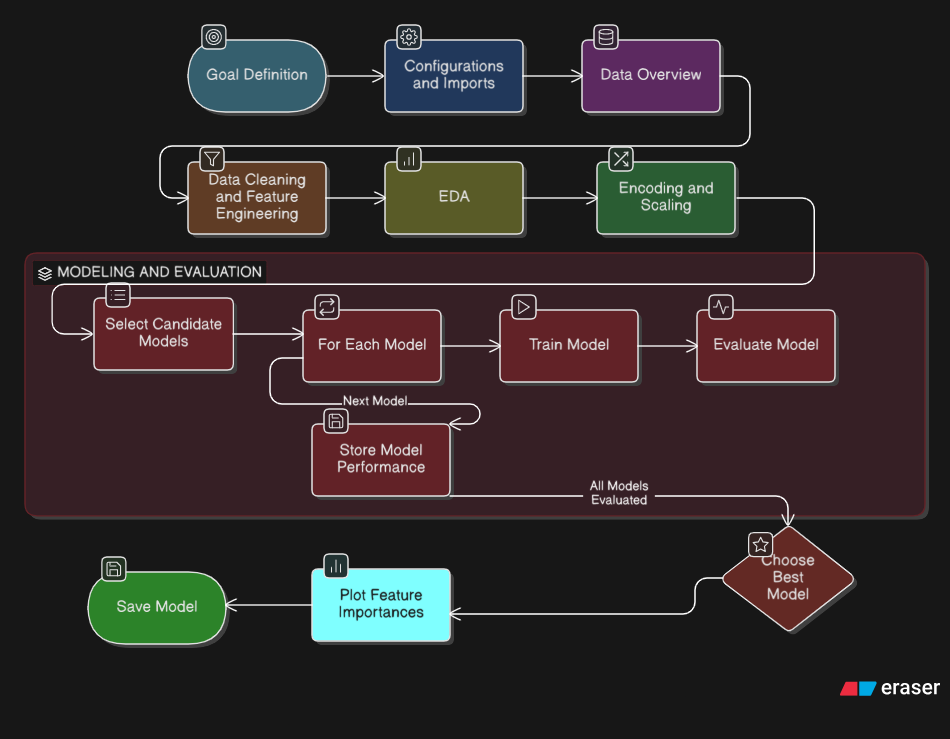

### 2.1 Shared Steps

1. Load all 16 tables from SQLite into pandas DataFrames
2. Construct the `enrollment_id → semester_id` bridge join
3. Engineer features at the student-semester level (attendance, LMS, behavior, integrity)
4. Merge student profile features (motivation, stress, target GPA, year of study)
5. Handle missing values and apply log / standard / min-max transformations

### 2.2 Goal-Specific Steps

| | Goal 1 — Regression | Goal 2 — Classification |
|---|---|---|
| **Target** | `weighted_score` (enrollment level) | `next_probation` (student-semester level) |
| **Groupby** | `enrollment_id` | `student_id × semester_id` |
| **Models** | Linear, Ridge, Lasso, ElasticNet, RF, GBM, XGBoost, LightGBM | Logistic Reg, Decision Tree, RF, GBM |
| **Metrics** | RMSE · MAE · R² | AUC · F1 · Precision · Recall |

---

## 3. Feature Engineering

### 3.1 The Bridge Join

Most raw tables are keyed on `enrollment_id` (one row per student-course-semester). Goal 2 requires analysis at the student-semester level. The bridge join resolves this:

```
enrollments  [ enrollment_id, student_id, offering_id ]
     ↕  merge on offering_id
course_offerings  [ offering_id, semester_id, course_id ]
     ↓
bridge  [ enrollment_id, student_id, semester_id ]
```

All enrollment-level tables are then grouped by `(student_id, semester_id)`.

### 3.2 Feature Groups

#### Attendance Features

| Feature | Source | Description |
|---|---|---|
| `att_rate` | `attendance` | Fraction of sessions marked Present |
| `abs_count` | `attendance` | Total absent sessions in the semester |
| `late_rate` | `attendance` | Fraction of sessions marked Late |
| `att_trend` | `attendance` | Δ attendance rate: second half minus first half of semester |

#### LMS Interaction Features

| Feature | Source | Description |
|---|---|---|
| `pageview_mean` | `lms_interactions` | Mean weekly pageviews |
| `minutes_watched_mean` | `lms_interactions` | Mean weekly video minutes watched |
| `forum_posts_sum` | `lms_interactions` | Total forum posts in semester |
| `quiz_attempts_sum` | `lms_interactions` | Total quiz attempts in semester |
| `pv_trend` | `lms_interactions` | Linear slope of weekly pageviews (polyfit deg=1) |
| `mw_trend` | `lms_interactions` | Linear slope of weekly minutes watched |

#### Behavior Features

| Feature | Source | Description |
|---|---|---|
| `engagement_mean` | `behavior_metrics` | Mean weekly engagement score (0–1) |
| `attention_mean` | `behavior_metrics` | Mean weekly attention score (0–1) |
| `inactivity_mean` | `behavior_metrics` | Mean weekly inactivity minutes |

#### Exam Integrity Features

| Feature | Source | Description |
|---|---|---|
| `similarity_mean` | `exam_integrity` | Mean similarity score across assessments |
| `jump_flags` | `exam_integrity` | Total sudden-jump flags in semester |
| `proctor_flags` | `exam_integrity` | Total proctoring flags in semester |

#### Student Profile Features

| Feature | Source | Description |
|---|---|---|
| `motivation_score` | `students` | Self-reported motivation (numeric scale) |
| `stress_level` | `students` | Self-reported stress level (numeric scale) |
| `year_of_study` | `students` | Current year of study |
| `target_gpa` | `study_plan_targets` | Student's self-declared GPA target |
| `risk_tolerance` | `study_plan_targets` | Risk tolerance for course selection |

#### Temporal Features

| Feature | Source | Description |
|---|---|---|
| `prev_gpa` | `outcomes_semester` | GPA from the previous semester (T-1) |
| `is_first_semester` | derived | Flag: 1 if no prior semester exists for this student |

---

## 4. Goal 1 — Grade Prediction (Regression)

### 4.1 Problem Definition

Given all available features for a student's enrollment, predict their final weighted assessment score for that course offering.

| Property | Value |
|---|---|
| **Target variable** | `weighted_score` — sum of (score × weight) across all assessments |
| **Analysis level** | Enrollment (one row per student-course-semester) |
| **Dataset size** | 3,920 rows · ~140 features after encoding |
| **Target range** | 21.8 – 97.5 (mean ≈ 56.2, std ≈ 11.5) |
| **Train / Test split** | 80% / 20% · random_state=42 |

### 4.2 Target Distribution

> **Fig 4.1 — Histogram of `weighted_score`**
> 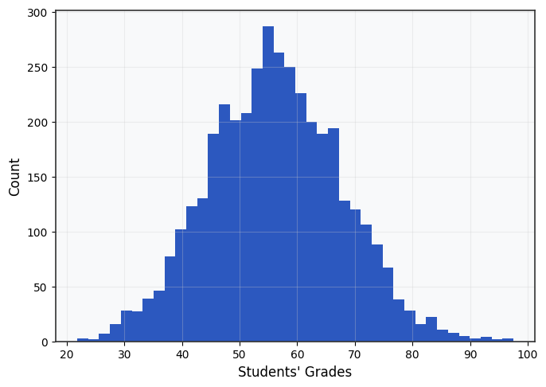

### 4.3 EDA Highlights

> **Fig 4.2 — Feature distributions (numerical)**
> 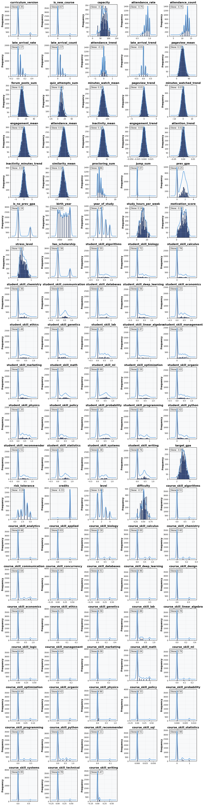

> **Fig 4.3 — Skewness chart across numerical features**
> 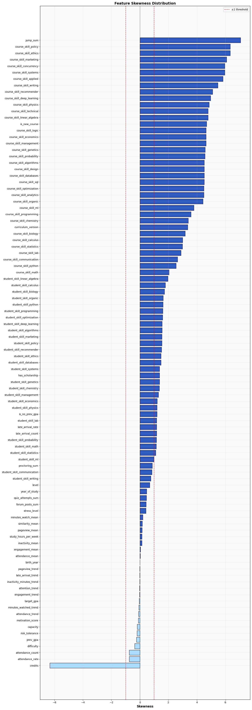

> **Fig 4.4 — Pearson correlation heatmap (features vs target)**
> 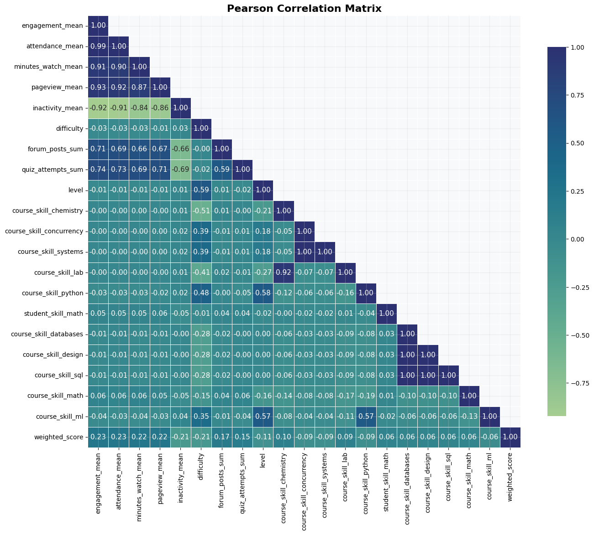

### 4.4 Preprocessing

- **Log transform** applied to: `quiz_attempts_sum`, `forum_posts_sum`, `late_arrival_count`
- **StandardScaler** applied to: trend features, GPA features, `capacity`, `target_gpa`, `minutes_watched_mean`
- **MinMaxScaler** applied to: rate features, count features, `difficulty`
- **OneHotEncoding** (`drop='first'`) applied to all categorical columns
- **Age** derived from `birth_year` — `birth_year` then dropped

### 4.5 Models Evaluated

- Linear Regression
- Ridge Regression
- Lasso Regression
- ElasticNet Regression
- Decision Tree Regressor
- Random Forest Regressor
- Gradient Boosting Regressor
- XGBoost Regressor
- LightGBM Regressor

### 4.6 Evaluation Metrics — Goal 1

#### Cross-Validation Results (5 fold) 

| Model                 | RMSE ↓ | MAE ↓  | R² ↑   |
| --------------------- | ------ | ------ | ------ |
| Linear Regression     | 11.185 | 8.949  | 0.045  |
| Ridge Regression      | 11.176 | 8.942  | 0.047  |
| Lasso Regression      | 11.215 | 8.945  | 0.041  |
| ElasticNet Regression | 11.171 | 8.913  | 0.049  |
| Decision Tree         | 15.867 | 12.579 | -0.899 |
| Random Forest         | 11.068 | 8.855  | 0.056  |
| Gradient Boosting     | 11.054 | 8.843  | 0.068  |
| XGBoost               | 12.004 | 9.634  | -0.100 |
| LightGBM              | 11.326 | 9.087  | 0.021  |

> ↓ lower is better · ↑ higher is better

### 4.7 Key Observations — Goal 1

> - Gdradient Boosting Achieved the R² score and lowest RMSE and MAE.
> - Ensambling methods (RF, GBM) slightly outperformed linear baselines, and the simple decision tree.
> - R² was low overall. Indicating that the data might have been syntheticly generated or not real. Or that the data may have weak feature-target signal by design.

> **Fig 4.5 — Predicted vs Actual scatter plot (best model)**
> 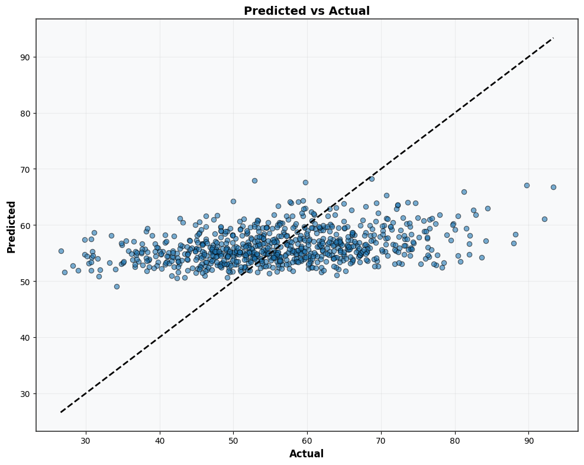

---

## 5. Goal 2 — Failure Risk Classification

### 5.1 Problem Definition

Given a student's full academic profile and behavior signals from semester T, predict whether they will be placed on academic probation in semester T+1.

| Property | Value |
|---|---|
| **Target variable** | `next_probation` — `probation_flag` shifted forward one semester |
| **Analysis level** | Student × Semester (bridge join required) |
| **Dataset size** | 660 rows after requiring a following semester to exist |
| **Class balance** | ~68% on probation · ~32% not on probation |
| **Train / Test split** | 80% / 20% · stratified by target · random_state=42 |
| **CV strategy** | 5-fold StratifiedKFold |

> **Leakage note:** `current_gpa` (semester T outcome) is a valid feature — it describes a completed past semester. Using `avg_score` from the **same** semester as the target would constitute leakage and is excluded.

### 5.2 Target Distribution

> **Fig 5.1 — Class balance bar chart and pie chart**
> 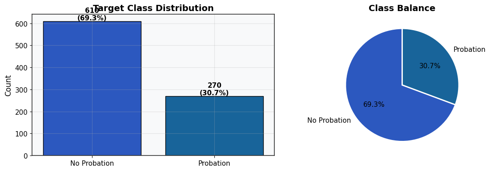

### 5.3 EDA Highlights

> **Fig 5.2 — Feature distributions by probation status**
> 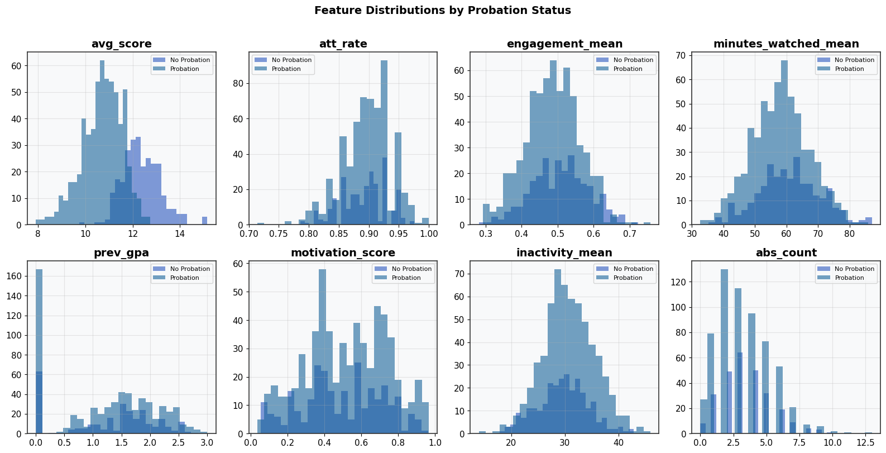

> **Fig 5.3 — Correlation heatmap — top 15 features vs `probation_flag`**
> 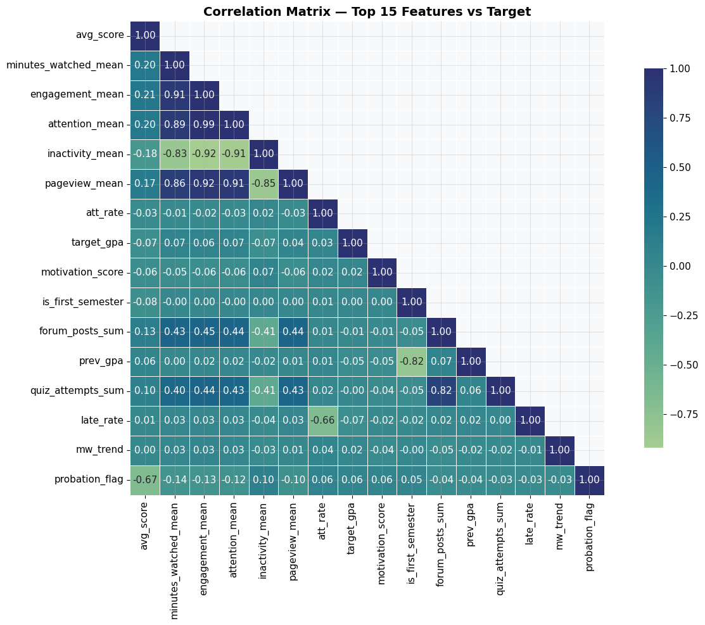

### 5.4 Models Evaluated

- Logistic Regression (C=0.5, max_iter=1000)
- Decision Tree Classifier (max_depth=6)
- Random Forest Classifier (n_estimators=200)
- Gradient Boosting Classifier (n_estimators=200, learning_rate=0.05)

### 5.5 Evaluation Metrics — Goal 2

#### Cross-Validation Results (5-Fold Stratified)

| Model               | AUC ↑  | F1 ↑   | Precision ↑ | Recall ↑ |
| ------------------- | ------ | ------ | ----------- | -------- |
| Logistic Regression | 0.9222 | 0.8994 | 0.8850      | 0.9148   |
| Decision Tree       | 0.8448 | 0.8631 | 0.8487      | 0.8787   |
| Random Forest       | 0.9065 | 0.9016 | 0.8756      | 0.9295   |
| Gradient Boosting   | 0.9095 | 0.8902 | 0.8719      | 0.9098   |


#### Best Model — Test Set Classification Report

| Class        | Precision | Recall | F1-Score | Support |
| ------------ | --------- | ------ | -------- | ------- |
| No Probation | 0.72      | 0.81   | 0.77     | 54      |
| Probation    | 0.91      | 0.86   | 0.89     | 122     |
| Macro avg    | 0.82      | 0.84   | 0.83     | 176     |
| Weighted avg | 0.85      | 0.85   | 0.85     | 176     |

**ROC-AUC (test set):** —  &nbsp;&nbsp; **Accuracy:** —

### 5.6 Model Diagnostics

> **Fig 5.4 — Model comparison bar chart (AUC / F1 / Precision / Recall)**
> 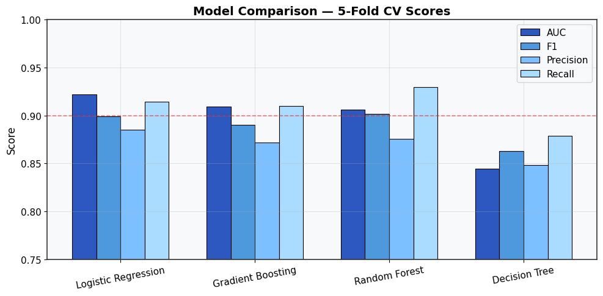

> **Fig 5.5 — Confusion matrix, ROC Curve and Precision-Recall Curve**
> 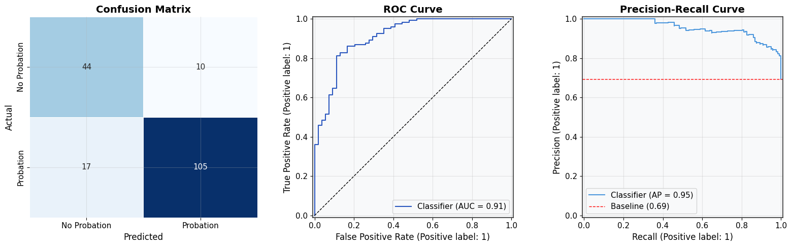

### 5.7 Feature Importance

> **Fig 5.6 — Feature importance bar chart (Gradient Boosting, Gini)**
> 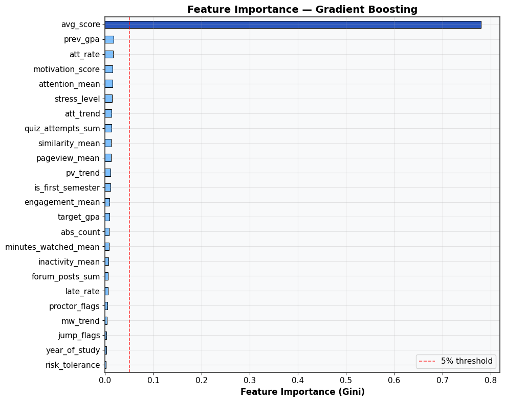

#### Top Influencing Factors

> - **Feature 1** (`avg_score`) — dominated the models weights and counted for ~78% of explaining the target.
> - **Feature 2** (`pv_trend`) 
> - **Feature 3** (`stress_level`)
> - **Feature 4** (`att_trend`)
> - **Feature 5** (`inactivity_mean`)

### 5.8 Key Observations — Goal 2

> - Gradient Boosting was the best preforming model by a slight margin. But overall all models preformed well.
> - `avg_score` feature was by far the most influential feature, as it solely counted for near 70% of feature importances.
> - behavioral signals show weak predictive power because the dataset it lacked a causal relationship between engagement and GPA.

---

## 6. Limitations & Future Work

### 6.1 Known Limitations

- **Synthetic data:** behavioral features (attendance, LMS, engagement) were generated independently from GPA. This artificially suppresses the predictive signal that would exist in real-world data.
- **Small dataset:** 660 student-semester rows for Goal 2 limits model complexity and generalisability.
- **Class imbalance:** ~68% positive rate in Goal 2 inflates F1 for the majority class — Precision for the minority (No Probation) class is lower.
- **No temporal validation:** a production model should be validated on a future held-out semester, not a random split.
- **Goal 1 R² ceiling:** regression performance is bounded by the weak feature-target correlation baked into the synthetic data.

### 6.2 Future Work

- **Temporal cross-validation:** train on semesters 1–3, validate on semester 4.
- **SMOTE or class weighting** to address imbalance in Goal 2.
- **SHAP values** for deeper per-student explainability beyond aggregate feature importance.
- **LSTM / sequence model** for Goal 1 using weekly grade trajectories as a time series.
- **Hybrid recommendation system** (Goal 5) using `student_skills × course_skills` cosine similarity.

---

## 7. Repository Structure

```
└── 📁Students Edu
    └── 📁data
        ├── edu_exam.sqlite
    └── 📁figures
    └── 📁grid_serch_results
        └── 📁student_grade_prediction
            ├── grid_search_results.csv
    └── 📁models
        ├── student_grade_pred_model.pkl
        ├── student_risk_model.pkl
    └── 📁notebooks
        ├── student_fail_risk_classification.ipynb
        ├── student_grade_prediction.ipynb
    ├── .gitignore
    └── README.md
```

---

## 8. Dependencies

| Package | Version (tested) | Usage |
|---|---|---|
| `pandas` | ≥ 2.0 | Data loading, merging, aggregation |
| `numpy` | ≥ 1.24 | Numerical operations, polyfit trends |
| `scikit-learn` | ≥ 1.3 | Preprocessing, models, metrics, CV |
| `xgboost` | ≥ 2.0 | XGBoost regressor (Goal 1) |
| `lightgbm` | ≥ 4.0 | LightGBM regressor (Goal 1) |
| `matplotlib` | ≥ 3.7 | All plots |
| `seaborn` | ≥ 0.13 | Heatmaps |
| `scipy` | ≥ 1.11 | Skewness calculation |
| `sqlite3` | stdlib | Database connection |
